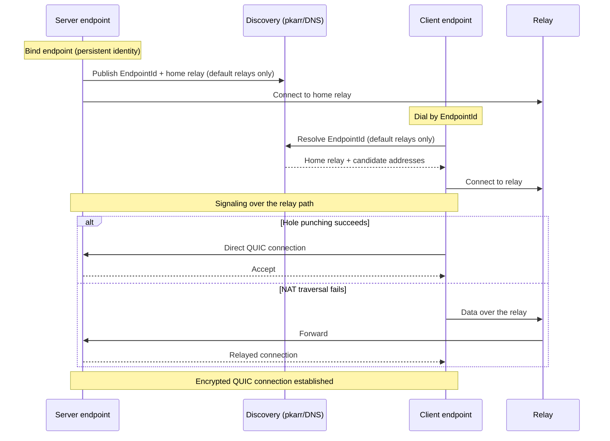
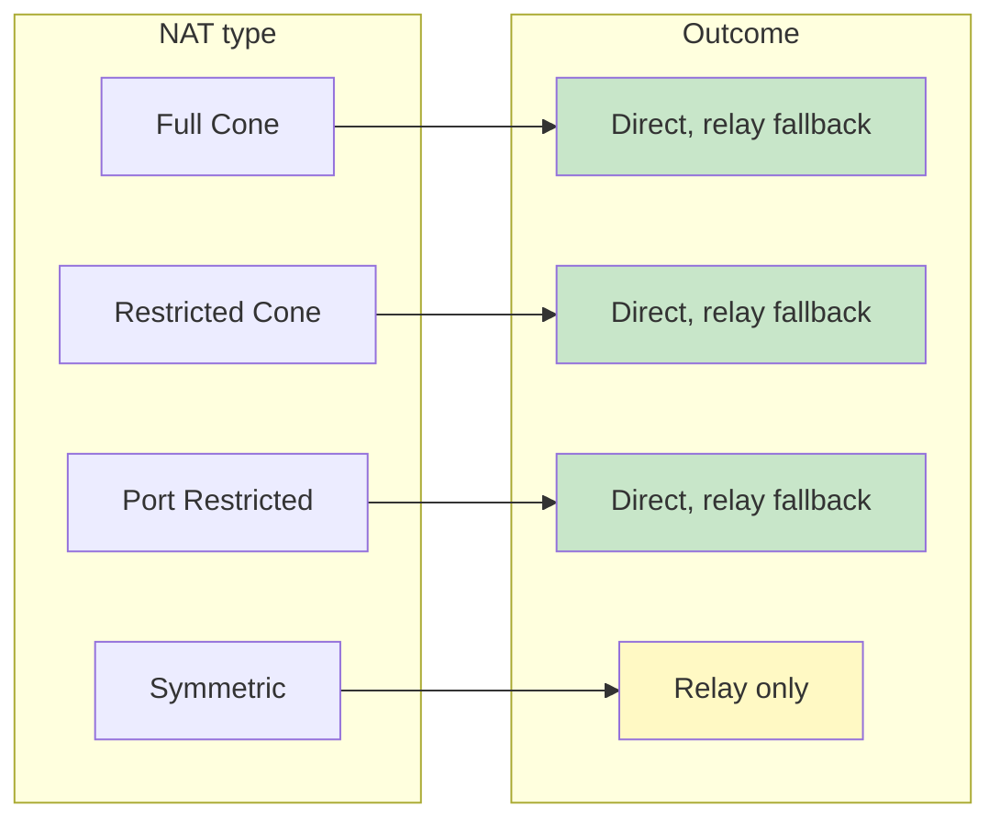
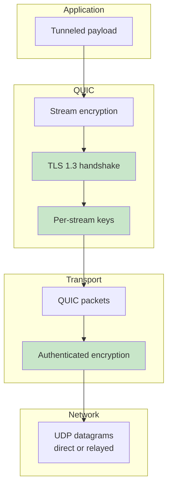

# NAT Traversal and the QUIC Transport

What [tunnel-rs], [ezvpn], and [flextunnel] all get from iroh, and behave
identically in: peer discovery, hole punching, relay fallback, and the QUIC/TLS
1.3 encryption stack. None of the three implements any of this itself — they
configure an `iroh::Endpoint` and hand it an ALPN.

For how relays are *configured* (default vs custom, hints, the startup probe),
see [relays-and-address-lookup.md](relays-and-address-lookup.md). For running
your own relay, see [self-hosting.md](self-hosting.md).

## What `iroh::Endpoint` provides

- **Discovery** — peer lookup by `EndpointId` via pkarr/DNS, plus mDNS on the
  local network. Internet discovery follows the relay mode; see
  [relays-and-address-lookup.md](relays-and-address-lookup.md).
- **NAT traversal** — coordinated hole punching to establish a direct path.
- **Relay** — fallback data transport when hole punching fails, and the
  signaling channel used to coordinate it.
- **QUIC** — the transport itself, with per-connection multiplexed streams.
- **Identity** — Ed25519 endpoint keys; the `EndpointId` *is* the public key.

## Connection establishment

The relay is used for **both** signaling and as a data fallback. The connection
starts relayed and upgrades to direct in the background if hole punching
succeeds — an established connection can switch paths mid-life, so all three
programs log the selected path and re-log on change (relay → direct).

With custom relays there is no discovery step: the dialer supplies the relay
URLs as hints instead. Everything after that is the same.

## NAT traversal capability by NAT type

Every NAT type connects; what varies is whether the path can be upgraded to
direct. Roughly ~70% of connections in the wild reach a direct path.

### Symmetric NAT and container overlays

Symmetric NAT assigns a different external port per destination, which defeats
STUN-based hole punching — those connections stay on the relay for their whole
life. This is not a failure mode to fix, but it does mean **relay bandwidth must
be sized for the peers that cannot hole-punch**.

The common surprise here is Kubernetes and similar container overlays: their
conntrack-based NAT behaves symmetrically, so pods on overlay networking always
fall back to relay. Running with host networking bypasses the overlay and
restores hole punching, at the cost of port conflicts and losing network-policy
enforcement.

## Encryption stack

All traffic is end-to-end encrypted by QUIC/TLS 1.3 between the two endpoints.
Relay operators forward ciphertext and can see connection *metadata* (which
endpoints talk to each other, when, and how much) but never plaintext.

Endpoint identity is the TLS identity: the `EndpointId` is an Ed25519 public
key, so dialing an ID authenticates the peer as a side effect of the handshake.
That authenticates the *endpoint*, not the user — each program layers its own
application-level authorization on top (Ed25519 authorized-keys in tunnel-rs and
flextunnel, the VPN handshake in ezvpn), so transport identity and access control
stay independent.

Each program pins a fixed QUIC ALPN, which keeps incompatible peers from
completing a handshake at all. That ALPN is internal to the end-to-end encrypted
connection and is never seen by a relay or an HTTP proxy in front of one — see
[iroh-relay-connection-trace.md](iroh-relay-connection-trace.md).

## Performance characteristics

> Illustrative, environment-dependent ranges — network conditions, NAT type,
> relay availability, and DNS all move these. Rough guidance, not guarantees.

| Phase | Typical |
|---|---|
| Discovery (default relays; skipped with relay hints) | 1–3s |
| Connection establishment | 0.5–2s |
| Total to a usable connection | 1.5–5s |

- **Direct path** — near-native throughput, with encryption overhead.
- **Relay path** — higher latency and potentially lower throughput; every byte
  makes an extra hop through the relay host.
- **Path upgrade** — a connection that starts relayed and later hole-punches
  gets direct-path performance without reconnecting.

[tunnel-rs]: https://github.com/andrewtheguy/tunnel-rs
[ezvpn]: https://github.com/flexaccessdev/ezvpn
[flextunnel]: https://github.com/flexaccessdev/flextunnel
