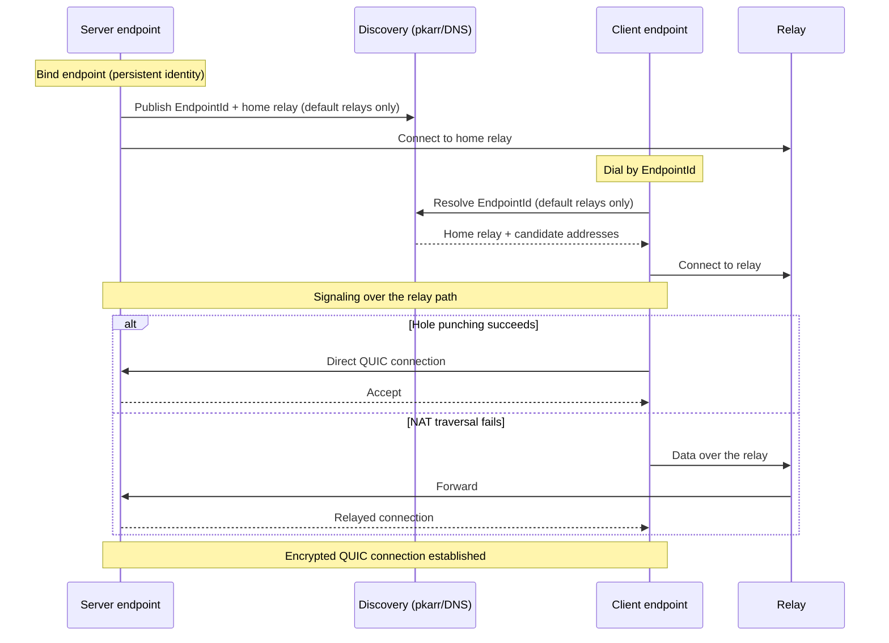
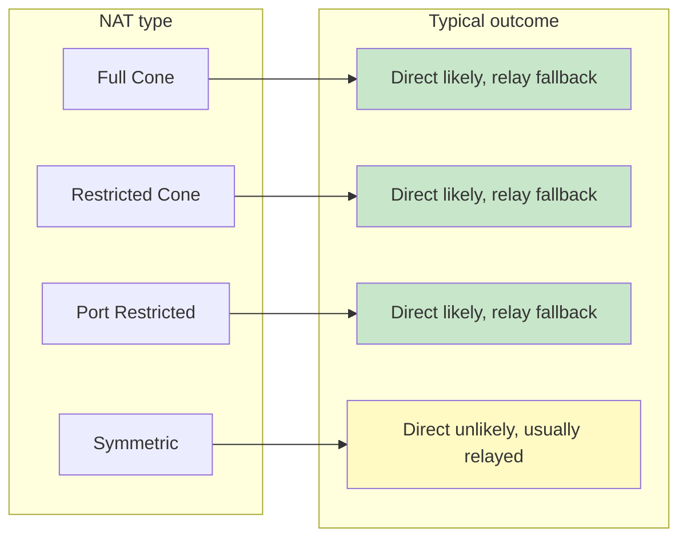
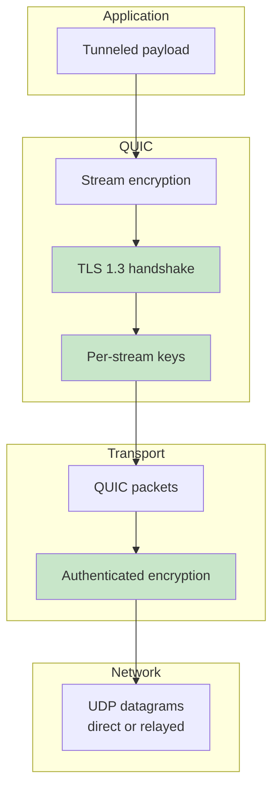

# NAT Traversal and the QUIC Transport

[tunnel-rs], [ezvpn], and [flextunnel] share the same iroh transport stack: hole
punching, relay fallback, and the QUIC/TLS 1.3 encryption stack are iroh's, and
none of the three implements any of it itself — they configure an
`iroh::Endpoint` and hand it an ALPN. Those shared transport primitives are what
this document describes.

What the three do *not* share is how they configure that endpoint. Address
lookup, relay-only mode, and platform behavior differ per program — ezvpn runs no
mDNS at all, tunnel-rs is the only one with a user-facing relay-only mode, and
flextunnel compiles mDNS out on iOS. See
[relays-and-address-lookup.md](relays-and-address-lookup.md) for the per-repo
matrix.

For how relays are *configured* (default vs custom, hints, the startup probe),
see [relays-and-address-lookup.md](relays-and-address-lookup.md). For running
your own relay, see [self-hosting.md](self-hosting.md).

## What `iroh::Endpoint` provides

- **Discovery** — peer lookup by `EndpointId` via pkarr/DNS, plus mDNS on the
  local network. Internet discovery follows the relay mode; see
  [relays-and-address-lookup.md](relays-and-address-lookup.md).
- **NAT traversal** — coordinated hole punching to establish a direct path.
- **Relay** — fallback data transport when hole punching fails, and the
  signaling channel used to coordinate it.
- **QUIC** — the transport itself, with per-connection multiplexed streams.
- **Identity** — Ed25519 endpoint keys; the `EndpointId` *is* the public key.

## Connection establishment

The relay is used for **both** signaling and as a data fallback. iroh sends the
QUIC Initials to *all* known paths at once — every candidate direct address and
every relay hint — so the initially selected path may be either direct or
relayed, depending on which one answers first. On a LAN, or when a direct address
is already known and reachable, a connection can be direct from the very first
packet; where a direct path is not (yet) usable, it starts relayed. Either way an
established connection can switch paths mid-life, so all three programs log the
selected path and re-log on change (the relay → direct upgrade after a successful
hole punch being the common case).

With custom relays there is no discovery step: the dialer supplies the relay
URLs as hints instead. Everything after that is the same.

## NAT traversal capability by NAT type

Under **any** NAT type a connection can still be carried by a relay — but only
when relay mode is enabled *and* at least one configured relay is actually
reachable from both peers. Neither is automatic: `RelayMode::Disabled` turns
relaying off entirely (all three programs leave relays on for real endpoints, so
this is normally a given), and a relay that is down, blocked by an egress
firewall, or rejecting the auth token is no fallback at all. When there is no
usable relay and hole punching fails, the connection fails. The per-relay startup
probe exists precisely to make that failure loud at startup rather than silent
later; see
[relays-and-address-lookup.md](relays-and-address-lookup.md#custom-relay-validation-the-per-relay-startup-probe).

Given a working relay, what the NAT type actually influences is the likelihood of
upgrading to a *direct* path — and NAT type alone does not decide that either:
the endpoint's port-mapping and filtering behavior, the address family (IPv6
often needs no hole punching at all), and any *additional* upstream NAT (CGNAT, a
second router) all move the outcome. Treat the table as a rule of thumb, not a
guarantee — the only way to know is to look at the path the program logs.

### Symmetric NAT

Symmetric NAT assigns a different external port per destination, so the port a
STUN probe observes is not the port the peer will actually send to. This often
defeats hole punching and leaves those connections on the relay. It is not a
failure mode to fix, but it does mean **relay bandwidth must be sized for the
peers that cannot hole-punch**.

### Kubernetes and container networking

Kubernetes is where this most often comes up, but "pods are behind symmetric NAT"
is not a property of Kubernetes — it is a property of the **CNI plugin and the
path**, and it varies widely:

- Pod egress to the internet is usually **SNAT'd by the node**. Whether that
  mapping is endpoint-independent (cone-like, hole-punchable) or
  endpoint-dependent (symmetric-like, not) depends on the CNI, the kube-proxy
  backend (iptables / IPVS / eBPF), and the node's own conntrack and NAT settings.
- Some setups have **no overlay NAT at all** on the path — CNIs that give pods
  natively routable addresses (AWS VPC CNI, Calico with BGP, many IPv6 and
  dual-stack deployments) can hole-punch from inside a pod.
- The node itself may sit behind a cloud NAT gateway or CGNAT, so removing the
  pod-level NAT does not necessarily remove the *last* one.
- Egress firewalls and `NetworkPolicy` can block the UDP that hole punching needs
  regardless of NAT type.

So do not treat `hostNetwork: true` as the standing fix. **Diagnose first:**
identify the CNI and kube-proxy mode in use, then read the path the program logs
(direct vs. relayed) from inside a normal pod. If pods already go direct, moving
to host networking buys nothing.

If diagnosis does point at pod-level NAT, `hostNetwork` puts the process in the
node's network namespace instead of the pod's, removing the overlay from the
path — whatever direct connectivity the *node* has then applies, which may or may
not restore hole punching for the reasons above. The costs are real: port
conflicts on the node, and **`NetworkPolicy` enforcement for host-network pods is
plugin-dependent and not guaranteed** — several plugins do not apply pod policies
to host-network traffic at all, so verify against your CNI's documentation rather
than assuming either way.

## Encryption stack

All traffic is end-to-end encrypted by QUIC/TLS 1.3 between the two endpoints.
Relay operators forward ciphertext and can see connection *metadata* (which
endpoints talk to each other, when, and how much) but never plaintext.

Endpoint identity is the TLS identity: the `EndpointId` is an Ed25519 public
key, so dialing an ID authenticates the peer as a side effect of the handshake.
That authenticates the *endpoint*, not the user — each program layers its own
application-level authorization on top (Ed25519 authorized-keys in tunnel-rs and
flextunnel, the VPN handshake in ezvpn), so transport identity and access control
stay independent.

Each program pins a fixed QUIC ALPN, which keeps incompatible peers from
completing a handshake at all. That ALPN is internal to the end-to-end encrypted
connection and is never seen by a relay or an HTTP proxy in front of one — see
[iroh-relay-connection-trace.md](iroh-relay-connection-trace.md).

## Performance characteristics

> Illustrative, environment-dependent ranges — network conditions, NAT type,
> relay availability, and DNS all move these. Rough guidance, not guarantees.

| Phase | Typical |
|---|---|
| Discovery (default relays; skipped with relay hints) | 1–3s |
| Connection establishment | 0.5–2s |
| Total to a usable connection | 1.5–5s |

- **Direct path** — near-native throughput, with encryption overhead.
- **Relay path** — higher latency and potentially lower throughput; every byte
  makes an extra hop through the relay host.
- **Path upgrade** — a connection that starts relayed and later hole-punches
  gets direct-path performance without reconnecting.

[tunnel-rs]: https://github.com/flexaccessdev/tunnel-rs
[ezvpn]: https://github.com/flexaccessdev/ezvpn
[flextunnel]: https://github.com/flexaccessdev/flextunnel
